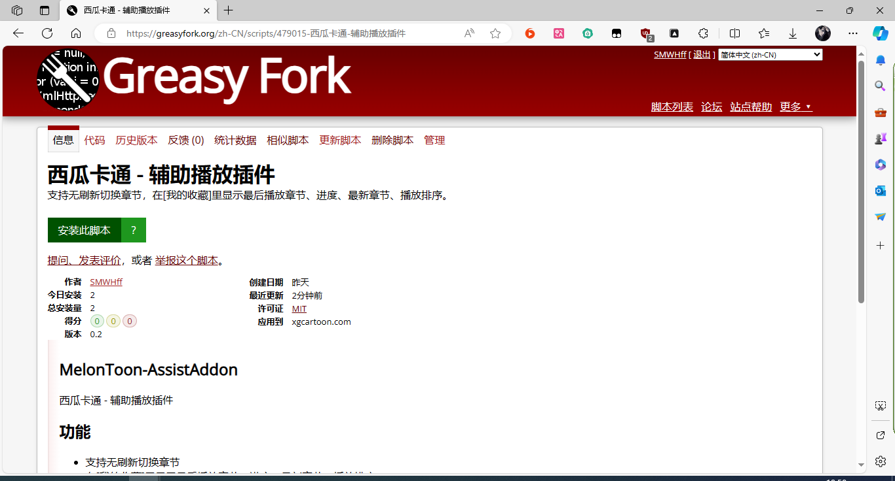

# MelonToon-AssistAddon
西瓜卡通 - 辅助播放插件

## 功能
- 支持无刷新切换章节
- 在[我的收藏]里显示最后播放章节、进度、最新章节、播放排序。

## 安装
本插件基于[油猴](https://www.baidu.com/s?wd=%E4%BB%80%E4%B9%88%E6%98%AF%E6%B2%B9%E7%8C%B4)开发，所以需要先安装油猴插件，支持的浏览器：Chrome, Microsoft Edge, Safari, Opera Next, 和 Firefox。

油猴安装完毕后，请点击[此链接](https://greasyfork.org/zh-CN/scripts/479015)进入安装。

## 效果截图

## 官网
[SMWHff's Blog | 梦痕编程](https://smwhff.com)

## 贡献
- [tampermonkey](https://www.tampermonkey.net/)
- [greasyfork](https://greasyfork.org/)